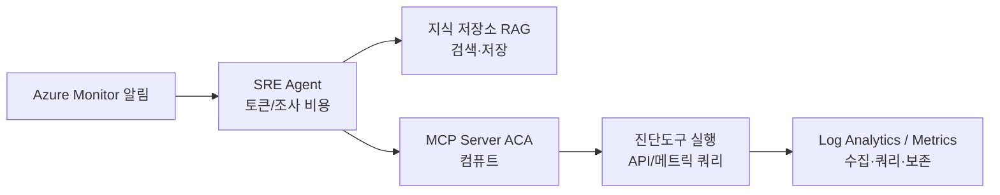

# SRE Agent 지식 활용 비용 가이드

> **목적**: 지식 문서 + 진단도구 + SRE Agent를 운영할 때 발생하는 **비용 구성요소**와 **최적화 방법**을 정리한다.
> ⚠️ 실제 단가는 리전·구독·요금제에 따라 다르며 변동된다. 아래는 **비용 구조와 절감 원칙** 중심(구체 단가는 Azure Pricing Calculator로 확인).

## 1. 비용이 발생하는 지점 (구성요소)

| # | 구성요소 | 비용 성격 | 주 원가 동인 |
|---|----------|-----------|--------------|
| 1 | **SRE Agent 조사** | 인시던트당 토큰(LLM) 사용 | 조사 횟수·컨텍스트 길이·반복 재호출 |
| 2 | **지식 저장소(RAG)** | 저장 + 검색 인덱스 | 문서 수/크기·인덱싱·쿼리 빈도 |
| 3 | **MCP Server(ACA)** | 컨테이너 컴퓨트 | vCPU/메모리·실행시간·min replica |
| 4 | **진단도구 실행** | Azure API/메트릭 호출 | 호출 빈도·window_minutes·리소스 수 |
| 5 | **Log Analytics** | 데이터 수집(GB)·보존·쿼리 | 수집량·보존기간·KQL 스캔량 |
| 6 | **Azure Monitor Metrics** | 표준 메트릭은 대개 무료, 일부 쿼리 유료 | 메트릭 쿼리 API 호출 |

## 2. 지식 저장소(RAG) 비용 관점
- **문서 수·크기가 곧 인덱스 비용**: 방대한 통합 문서보다 **잘게 쪼갠 문서**가 저장·검색 모두 효율적(디자인 가이드 원칙과 일치).
- **중복 제거**: 같은 내용이 여러 문서에 흩어지면 인덱스·검색 토큰 낭비.
- **검색 결과 수(top-k) 조절**: Agent가 참조하는 청크 수가 많을수록 토큰(=비용) 증가 → 문서가 정확히 매칭되면 top-k를 낮게 유지 가능.
- **오래된/미사용 문서 정리**: 적중 안 되는 문서는 인덱스만 차지.

## 3. SRE Agent(LLM 토큰) 비용 관점 — 가장 큰 변수
- **컨텍스트 길이 = 비용**: 진단도구 출력이 장황하면 토큰이 커진다 → 도구는 `summary`/`recommended_actions`처럼 **요약된 구조화 출력**을 제공(이미 적용됨).
- **재호출 루프 최소화**: `needs_input` 자율 발견은 유용하지만 무한 재호출은 비용↑ → 필요한 파라미터를 **한 번에** 요청하도록 문서에 명확히 기술.
- **불필요한 조사 트리거 억제**: 노이즈 알림이 많으면 조사 비용이 곱해진다 → 알림 임계값·중복 억제(alert dedup) 설정.

## 4. 진단도구 실행 비용 관점
- **window_minutes 최적화**: 조사 목적에 맞는 최소 구간 사용(무조건 24h보다 60~120분).
- **호출 빈도**: `--watch` 연속 수집이나 cron은 편리하지만 API·수집 비용 누적 → 필요한 리소스만.
- **표준 메트릭 우선**: Azure Monitor 표준 메트릭 쿼리는 로그 수집보다 저렴한 경우가 많음.
- **대상 범위 제한**: 리소스 전체 스캔보다 문제 리소스로 좁히기.

## 5. Log Analytics 비용 관점 (Windows 이벤트 로그 등)
- **수집량(GB)이 최대 원가**: Windows `Event` 테이블은 무분별 수집 시 급증 →
  - **필요한 로그만 수집**: DCR(데이터 수집 규칙)로 Level(Error/Critical)·Event ID 필터링.
  - **Verbose/Info 레벨 제외**, 필요한 채널(System/Application/Security)만.
- **보존기간(retention)**: 장기 보존은 비용↑ → 핫(분석) 기간 짧게 + 아카이브/Basic Logs 활용.
- **Basic/Auxiliary Logs 계층**: 조사용 원시 로그는 저비용 계층 검토.
- **KQL 스캔량**: 광범위 `search *`보다 테이블·시간·컬럼 한정.

## 6. MCP Server(ACA) 비용 관점
- **min replica = 0** 검토: 상시 대기가 불필요하면 scale-to-zero로 유휴 비용 제거(단, 콜드스타트 지연 감안).
- **적정 vCPU/메모리**: 진단도구는 경량 → 과대 할당 회피.
- **이미지·의존성 슬림화**: 불필요한 SDK 제거로 시작·컴퓨트 효율.

## 7. 비용 최적화 체크리스트
- [ ] 지식 문서: 잘게 분할 + 중복 제거 + 미사용 문서 정리
- [ ] 도구 출력: 요약 구조화(`summary`/`recommended_actions`)로 토큰 절감
- [ ] `needs_input` 재호출 루프: 파라미터 한 번에 요청, 무한루프 방지
- [ ] 알림: 노이즈·중복 억제로 불필요한 조사 트리거 차단
- [ ] window_minutes: 목적 대비 최소 구간
- [ ] Log Analytics: DCR로 Error/Critical·특정 Event ID만 수집, 보존기간·Basic Logs 검토
- [ ] ACA: scale-to-zero / 적정 리소스 / 슬림 이미지
- [ ] 표준 메트릭 우선, 로그는 필요한 것만

## 8. 요금 확인 방법
- **Azure Pricing Calculator**: Container Apps, Log Analytics, (사용 시) Azure AI Search 등 개별 요금 산정.
- **Cost Management + 예산 경보**: 리소스 그룹(예: `rg-...-diag-...`)에 태그 기반 비용 추적 + 예산 알림 설정.
- **가장 큰 3대 변수**: ① LLM 토큰(조사 빈도·컨텍스트) ② Log Analytics 수집량 ③ ACA 상시 가동 여부.

## 9. 참고 (연계)
- 디자인 가이드: `GUIDE-Knowledge-Design.md` (문서 분할·중복 제거 = 비용 절감과 직결).
- 도구 출력 요약 구조는 이미 표준화됨(토큰 비용 절감에 기여).
